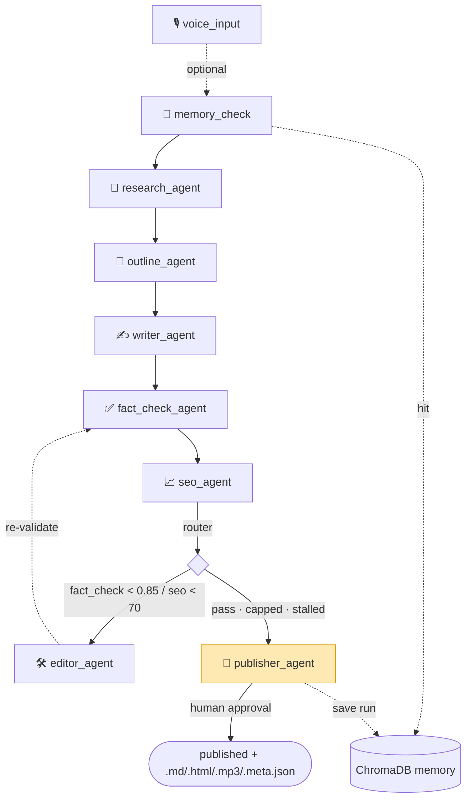

# 📝 Agentic Content Pipeline

A multi-agent content publishing pipeline built on **LangGraph**. It researches a topic against
real web sources, writes an article, fact-checks every claim against those sources, scores SEO,
and loops back through an editor until quality thresholds pass — then a human approves and it
exports a **Medium-ready** article.

This repo ships **two front ends over a shared agent core**:

- **V1** — a 6-agent pipeline with a **Streamlit** demo (`app.py`). Simple, single-file UI.
- **V2** — an 8-agent pipeline with **deep-research RAG, a memory layer, voice I/O, parallel
  multi-topic batches**, and a **Next.js + FastAPI** dashboard with live SSE streaming.

The agents in `pipeline/` are **async and shared**: V1 drives them through a sync adapter so its
Streamlit app stays unchanged; V2 streams them over FastAPI.

---

## V1 vs V2

| Capability | V1 | V2 |
|---|---|---|
| Agents | 6 | 8 (adds `memory_check`, `outline_agent`) |
| Research | Tavily snippets | Tavily **+ full-page fetch (httpx/BS4) → RAG chunks + credibility scoring + [HIGH/MED/LOW] fact tags** |
| Writing | outline + draft | persona-shaped (`technical / beginner / op-ed`) + **self-critique → revise** pass |
| Fact-check | snippet match | **embedding RAG over page chunks** + per-claim trace |
| SEO | density/headings/readability | + entity density, title-tag, **`fix_now` / `fix_later`** split |
| Loop visibility | revision count | **scored `RevisionRound` diffs** (difflib) + **editor-stall gate** |
| Memory | — | **ChromaDB** vector store; reuse sources across runs |
| Voice | — | **Whisper** topic in, **TTS** audio summary out |
| Multi-topic | — | **LangGraph Send API**, parallel subgraphs (cap 3) |
| UI | Streamlit | **Next.js + ReactFlow** live graph + **FastAPI SSE** |
| HITL | Streamlit button / CLI | FastAPI `/approve` + `/reject` (with feedback) |

---

## V2 Architecture



Multi-topic batch (`pipeline/graph_batch.py`) fans out one full subgraph per topic via the
**Send API** (capped at `MAX_PARALLEL_SUBGRAPHS`) and aggregates `BatchResult`s.

---

## How the feedback loop works

After the SEO agent a conditional **router** (`pipeline/graph.py`) decides the next hop. Checks
are ordered so the loop can never run away:

1. `revision_count >= MAX_REVISIONS` → **publisher** (attaches a "needs human review" warning)
2. scores pass (`fact_check ≥ 0.85` **and** `seo ≥ 70`) → **publisher**
3. **stall gate** — would loop, but the last edit barely changed anything
   (`edit_distance < 0.03`) → **publisher** ("editor stalled")
4. otherwise → **editor**, which re-validates through `fact_check → seo`

Every decision is logged, e.g.:

```
[ROUTER] Round 1 | fact_check=0.71 (<0.85) | seo=74 | edit_dist=n/a -> editor_agent
[ROUTER] Round 2 | edit_dist=0.012 < 0.030 -> publisher_agent (editor stalled)
```

Each editor pass records a scored `RevisionRound` (in `meta.json` → `revision_history`):

```json
{
  "round_number": 1,
  "fact_check_score": 0.71,
  "seo_score": 74,
  "diff_summary": "3 of 6 section(s) changed (edit distance 0.218)",
  "sections_changed": ["How the Mediterranean Diet Supports Heart Health"],
  "edit_distance": 0.218
}
```

---

## Setup

Requires **Python 3.11+** and (for V2's frontend) **Node 18+**.

```powershell
# 1) Python deps (shared by V1 + V2)
py -3.12 -m venv .venv
.\.venv\Scripts\Activate.ps1
pip install -r requirements.txt

# 2) Keys
copy .env.example .env   # set OPENAI_API_KEY + TAVILY_API_KEY (see .env.example for V2 vars)
```

No keys? Everything runs offline with deterministic fakes: `set PIPELINE_MOCK=1` (PowerShell:
`$env:PIPELINE_MOCK="1"`).

## Running

**V1 — Streamlit:**
```powershell
streamlit run app.py
# or CLI: python run_cli.py "Mediterranean diet health benefits" "Mediterranean diet" --yes
```

**V2 — FastAPI backend + Next.js frontend** (two terminals):
```powershell
# backend  (http://localhost:8000)
uvicorn v2.backend.main:app --port 8000 --reload

# frontend (http://localhost:3000)
cd v2/frontend && npm install && npm run dev
```
Open http://localhost:3000 → enter a topic (or upload audio) → watch the agent graph stream live
→ approve at the gate → download the article + audio.

## How to publish to Medium

Medium no longer issues API tokens to new accounts, so the publisher emits clean **semantic
HTML** for Medium's **"Import a story"** flow:

1. Download `<slug>.html` from the output viewer.
2. Host it at any public URL (GitHub Pages, gist, S3…).
3. Go to **medium.com/p/import**, paste the URL, and import.

The `.md` and `<slug>.meta.json` (title, keyword, scores, sources, `revision_history`) are written
alongside, plus `<slug>_summary.mp3` for voice runs.

## Project structure

```
agentic-content-pipeline/
├─ app.py                     # V1 Streamlit UI
├─ run_cli.py                 # V1 CLI
├─ pipeline/                  # shared async agents + graphs
│  ├─ state.py                # PipelineState / V2PipelineState + Pydantic payloads
│  ├─ config.py  llm.py       # config + LLM/search/embeddings/audio factories (+ mock mode)
│  ├─ graph.py                # V1 graph + router (+ sync adapter for async nodes)
│  ├─ graph_v2.py             # V2 8-node async graph
│  ├─ graph_batch.py          # multi-topic Send-API batch graph
│  └─ agents/                 # research, memory_check, outline, writer, fact_check, seo, editor, publisher
├─ memory/store.py            # ChromaDB wrapper
├─ voice/                     # whisper_input.py, tts_output.py
├─ v2/backend/                # FastAPI app (main.py) + SSE run-state store (stream.py)
├─ v2/frontend/               # Next.js 14 + ReactFlow + Tailwind dashboard
├─ output/                    # generated articles (gitignored)
└─ tests/                     # 38 tests, mock mode (agents, graph, memory, voice, batch, api, v2 e2e)
```

## Testing

```powershell
pytest          # full suite in mock mode — no API keys, no network
```

Covers each agent, the router + loop guard + stall gate, the memory layer, voice, the batch
Send-API graph, the FastAPI SSE endpoints (run/approve/batch), and V2 end-to-end flows.

## Design decisions

- **Shared async agents, two front ends.** Agents are `async def`; V1's graph wraps them in a sync
  adapter so `app.py` is untouched, while V2 streams them via FastAPI `astream_events`.
- **TypedDict graph state + Pydantic payloads.** `V2PipelineState` extends V1's `PipelineState`;
  `Source`/`RevisionRound`/`ClaimTrace`/… are Pydantic for validation + clean serialization.
- **Honest metrics.** Keyword density, headings, `textstat` readability, credibility, and
  `edit_distance` are computed in code; the LLM only adds judgement and structured outputs.
- **HITL via `interrupt_before` + checkpointer**, resumable from both Streamlit and FastAPI.
- **Memory uses our own embeddings** (Chroma's default embedder disabled → no model download).
- **Mock mode everywhere** (LLM, embeddings, Whisper, TTS, page-fetch, ephemeral Chroma) keeps the
  whole suite free, offline, and CI-friendly.

## Screenshots

Add to `docs/screenshots/` and reference here:

```
docs/screenshots/v2-dashboard.png    # start a run / memory / batch
docs/screenshots/v2-run-graph.png    # live ReactFlow agent graph + state panel
docs/screenshots/v2-hitl.png         # approval gate + revision timeline
docs/screenshots/v2-output.png       # article viewer + downloads + audio
```

## License

MIT — portfolio project.
