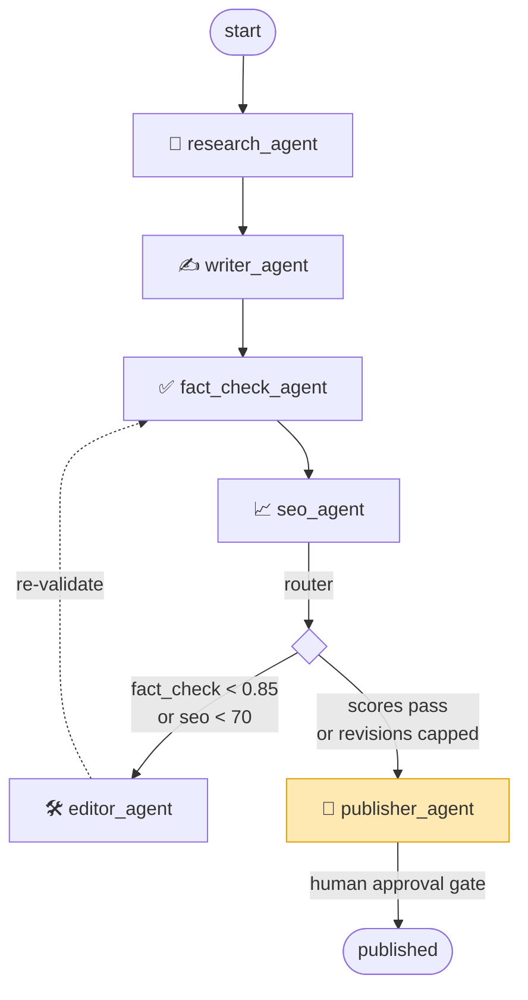

# 📝 Agentic Content Pipeline

A multi-agent content publishing pipeline built on **LangGraph**. It researches a topic against
real web sources, writes an article, fact-checks every claim against those sources, scores SEO,
and loops back through an editor agent until quality thresholds pass — then a human approves and
it exports a **Medium-ready** article (`.md` + `.html` + `.meta.json`).

Six specialized agents share one typed state object. A conditional **router** with a **loop guard**
is what makes this a true multi-agent system rather than a linear chain.

## Architecture



- **research_agent** → Tavily search → 5–8 real `Source` objects + a bullet **fact sheet**, each
  fact tagged with the source URL(s) it came from.
- **writer_agent** → a structured H2/H3 outline, then a ~900–1300-word markdown draft using **only**
  facts in the fact sheet.
- **fact_check_agent** → extracts every claim, cross-checks against the sources, returns
  `fact_check_score` (0–1) + structured `flagged_claims`.
- **seo_agent** → keyword density, heading structure, meta description, and `textstat` Flesch
  readability → `seo_score` (0–100) + structured `seo_feedback`.
- **editor_agent** → rewrites **only** the flagged sections, increments `revision_count`.
- **publisher_agent** → human-in-the-loop gate; on approval exports the Medium-ready files.

## How the feedback loop works

After the SEO agent, a conditional router decides the next hop. The checks are **ordered so the
loop can never run forever** (`config.py`):

1. `revision_count >= MAX_REVISIONS` → **publisher** (and attach a "needs human review" warning) — *checked first*
2. `fact_check_score < FACT_CHECK_THRESHOLD (0.85)` → **editor**
3. `seo_score < SEO_THRESHOLD (70)` → **editor**
4. otherwise → **publisher**

The editor loops back through `fact_check → seo` so every revision is re-validated. Every decision
is logged, so the loop is observable:

```
router: fact_check_score 0.50 < 0.85 -> editor_agent (revision 1)
editor_agent: revision 1 applied (2 change(s))
router: fact_check_score 0.50 < 0.85 -> editor_agent (revision 2)
router: fact_check_score 0.50 < 0.85 -> editor_agent (revision 3)
router: revision_count 3 >= MAX_REVISIONS 3 -> publisher_agent (loop guard)
```

## Tech stack

LangGraph · LangChain · OpenAI (`gpt-4.1` / `gpt-4.1-mini` via `langchain-openai`) · Tavily
(real web search) · Pydantic v2 (typed state + structured outputs) · textstat (readability) ·
Streamlit (UI) · python-dotenv · pytest.

Every agent that returns scores or flags uses **OpenAI structured outputs**
(`with_structured_output`) — never regex parsing of free text.

## Project structure

```
agentic-content-pipeline/
├─ app.py                 # Streamlit UI (entry point)
├─ run_cli.py             # CLI runner with a yes/no HITL gate
├─ conftest.py            # forces mock mode for the test session
├─ pipeline/
│  ├─ state.py            # PipelineState (TypedDict) + Source / FlaggedClaim (Pydantic)
│  ├─ config.py           # models, thresholds, MAX_REVISIONS, key loading
│  ├─ llm.py              # get_llm() / get_search_client() + deterministic mock mode
│  ├─ graph.py            # build_graph(): nodes, edges, router, loop guard, HITL interrupt
│  └─ agents/             # research, writer, fact_check, seo, editor, publisher
├─ output/                # generated .md / .html / .meta.json (gitignored)
├─ tests/                 # agent smokes + router/guard + Streamlit AppTest flow
├─ requirements.txt
└─ .env.example
```

## Setup (Windows / PowerShell)

```powershell
py -3.12 -m venv .venv          # Python 3.11+ required
.\.venv\Scripts\Activate.ps1
pip install -r requirements.txt
copy .env.example .env          # then edit .env: OPENAI_API_KEY + TAVILY_API_KEY
```

On macOS/Linux: `python3 -m venv .venv && source .venv/bin/activate && pip install -r requirements.txt`.

## Running

**Streamlit demo** — graph diagram, live per-agent progress, loop-back badge, the approval gate,
and download buttons:

```powershell
streamlit run app.py
```

**CLI** — runs to the approval gate, prints the draft + quality report, then prompts:

```powershell
python run_cli.py "Mediterranean diet health benefits" "Mediterranean diet"
python run_cli.py "<topic>" "<keyword>" --yes   # auto-approve (non-interactive)
```

**Offline / no keys** — run everything with deterministic fakes:

```powershell
$env:PIPELINE_MOCK = "1"; streamlit run app.py     # or: pytest
```

## Configuration

All knobs live in [`pipeline/config.py`](pipeline/config.py) and can be overridden via env vars
(see [`.env.example`](.env.example)):

| Setting | Default | Meaning |
|---|---|---|
| `MODEL_STRONG` | `gpt-4.1` | writer + editor |
| `MODEL_MINI` | `gpt-4.1-mini` | research, fact-check, SEO (cost-aware) |
| `FACT_CHECK_THRESHOLD` | `0.85` | below → loop to editor |
| `SEO_THRESHOLD` | `70` | below → loop to editor |
| `MAX_REVISIONS` | `3` | hard cap; loop guard |
| `PIPELINE_MOCK` | unset | `1` → offline mock mode |

## Testing

```powershell
pytest          # 15 tests, mock mode, no API keys or network
```

Covers each agent, the router decisions, the loop-then-guard behavior, and the full Streamlit
flow (via Streamlit's `AppTest`). External calls are mocked so the suite is free and CI-friendly.

## Design decisions

- **TypedDict graph state + Pydantic payloads.** LangGraph applies partial per-node updates, which
  maps cleanly onto a `TypedDict`; `Source` / `FlaggedClaim` and every agent's output stay Pydantic
  models for validation and structured outputs.
- **HITL via `interrupt_before` + checkpointer.** The graph is compiled with a `MemorySaver` and
  `interrupt_before=["publisher_agent"]`, so it pauses before publishing and resumes on approval —
  the idiomatic LangGraph pattern, shared by both the UI and the CLI.
- **Honest SEO metrics.** Keyword density, heading counts, and `textstat` readability are computed
  in code (not guessed by the LLM); the LLM only adds judgment, suggestions, and the meta description.
- **Anti-hallucination by construction.** The writer may use only fact-sheet facts; the research
  agent constrains citations to URLs Tavily actually returned; the fact-checker scores support.
- **Mock mode.** A deterministic fake LLM + search client make the whole pipeline runnable (and
  testable) offline with no keys.
- **Graph diagram = mermaid.js via an embedded component.** Renders reliably with no system
  Graphviz dependency. (Streamlit deprecates `components.v1.html` in favor of `st.iframe`/`st.html`;
  the iframe-embed approach is kept because it reliably executes the mermaid script — swap to a
  dedicated mermaid component if a future Streamlit removes it.)
- **Medium export as HTML.** Medium no longer issues API tokens to new accounts, so the publisher
  emits clean semantic HTML for the "Import a story" feature, plus markdown and a metadata sidecar.

## Screenshots

Add screenshots to `docs/screenshots/` and reference them here, e.g.:

```
docs/screenshots/01-graph.png      # the pipeline graph + inputs
docs/screenshots/02-approval.png   # the quality report + approval gate
docs/screenshots/03-published.png  # the published article + downloads
```
